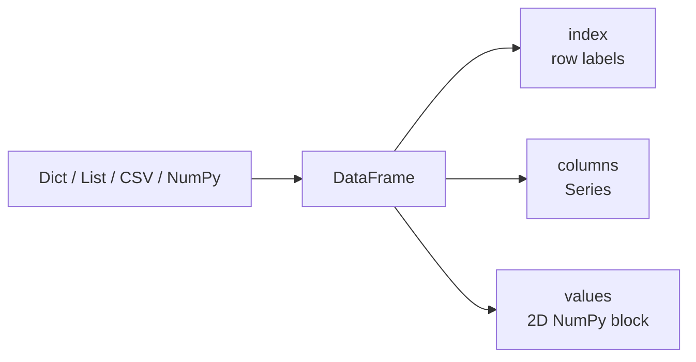
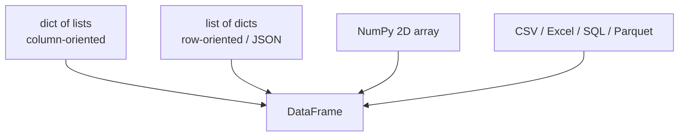
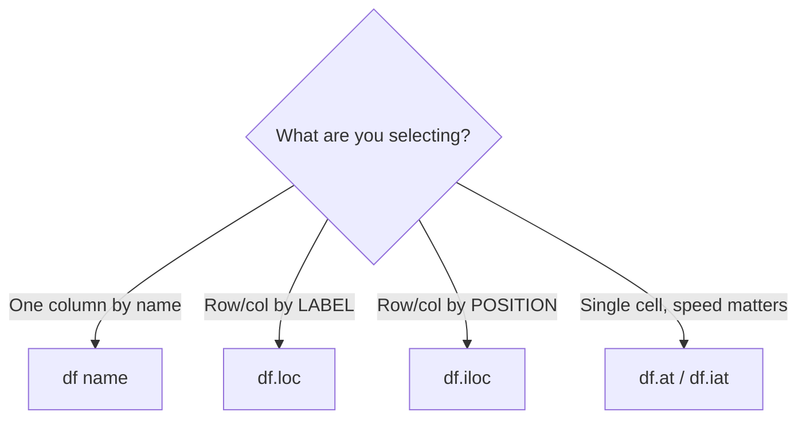
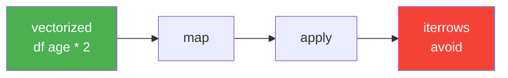
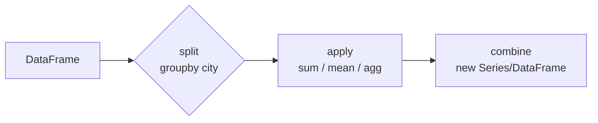

# DataFrame in Pandas — Full Course

*The 2D workhorse of pandas: what it is, how to build it, select from it, clean it, combine it, reshape it, and use it like a pro.*

> **Prereq:** `0.1 intro-to-pandas.md` (install + setup), `0.2 pandas series.md` (Series, `loc`/`iloc`). If you know `Series`, a `DataFrame` is just many `Series` sharing one index.

---

## Table of Contents

1. [What Is a DataFrame?](#1-what-is-a-dataframe)
2. [Anatomy — Visual Map](#2-anatomy--visual-map)
3. [Creating DataFrames — 7 Ways](#3-creating-dataframes--7-ways)
4. [Inspection — See What You Have](#4-inspection--see-what-you-have)
5. [Selection — `[]`, `.loc`, `.iloc`, `.at`](#5-selection---loc-iloc-at)
6. [Filtering Rows](#6-filtering-rows)
7. [Adding, Modifying, Renaming Columns](#7-adding-modifying-renaming-columns)
8. [Dropping & Sorting](#8-dropping--sorting)
9. [Missing Data](#9-missing-data)
10. [Dtypes & Conversion](#10-dtypes--conversion)
11. [Strings, Dates, Apply](#11-strings-dates-apply)
12. [GroupBy — Split-Apply-Combine](#12-groupby--split-apply-combine)
13. [Combining — Merge, Join, Concat](#13-combining--merge-join-concat)
14. [Reshaping — Pivot, Melt, Stack](#14-reshaping--pivot-melt-stack)
15. [IO — Read / Write](#15-io--read--write)
16. [Performance & Iteration](#16-performance--iteration)
17. [Pitfalls](#17-pitfalls)
18. [Cheat Sheet](#18-cheat-sheet)
19. [Exercises + Solutions](#19-exercises--solutions)
20. [Resources](#20-resources)

---

## 1. What Is a DataFrame?

A **DataFrame** is a **2-dimensional, size-mutable, labeled table** — rows + columns, like a spreadsheet, SQL table, or dict of Series.

Key facts:

| Property | Meaning |
|---|---|
| 2D | `df.shape` → `(n_rows, n_columns)` |
| Labeled axes | rows have an **index**, columns have **names** |
| Heterogeneous | each column can have its own dtype (`int`, `str`, `float`, `datetime`) |
| Size-mutable | you can add/drop rows and columns |
| Built on NumPy | each column is essentially a `Series` / NumPy array → vectorized ops are fast |

Visual — Series vs DataFrame:

```text
  Series (1D)                  DataFrame (2D)
  ──────────                   ──────────────
  index │ value                │ name │ age │ city  │
  ──────┼──────                ├──────┼─────┼───────┤
    a   │ 100                  │ Ali  │ 25  │ Cairo │ ← row 0 (index=0)
    b   │ 102             ═══► │ Sara │ 30  │ Giza  │ ← row 1 (index=1)
    c   │ 104                  │ Omar │ 22  │ Alex  │ ← row 2 (index=2)
         ↑                        ↑      ↑      ↑
       1 column              3 Series sharing one index
```

Mental model:



---

## 2. Anatomy — Visual Map

Take this DataFrame:

```python
import pandas as pd

df = pd.DataFrame(
    {"name": ["Ali", "Sara", "Omar"],
     "age": [25, 30, 22],
     "city": ["Cairo", "Giza", "Alex"]}
)
print(df)
#     name  age   city
# 0    Ali   25  Cairo
# 1   Sara   30   Giza
# 2   Omar   22   Alex
```

Annotated map (learn this picture — everything else refers to it):

```text
         columns ──►  "name"   "age"   "city"
                     ┌────────┬───────┬────────┐
  index │ axes │    │  col0  │ col1  │  col2  │  dtypes:
   ─────┼──────┼────┼────────┼───────┼────────┤   name: object (str)
     0  │ row0 │    │  Ali   │  25   │ Cairo  │   age : int64
   ─────┼──────┼────┼────────┼───────┼────────┤   city: object (str)
     1  │ row1 │    │  Sara  │  30   │  Giza  │
   ─────┼──────┼────┼────────┼───────┼────────┤
     2  │ row2 │    │  Omar  │  22   │  Alex  │
                     └────────┴───────┴────────┘
                        ▲        ▲        ▲
                        │        │        └─ df["city"] → Series
                        │        └────────── df["age"]  → Series (int64)
                        └─────────────────── df["name"] → Series (object)
```

Core attributes:

```python
df.shape        # (3, 3) → (rows, cols)
df.size         # 9 → total cells
df.index        # RangeIndex(start=0, stop=3, step=1)
df.columns      # Index(['name', 'age', 'city'])
df.dtypes       # dtype per column
df.values       # 2D NumPy array underneath
df.axes         # [index, columns]
```

```text
df.shape = (rows, cols)

        cols (axis=1)
       ┌───┬───┬───┐
rows   │ ● │ ● │ ● │
(axis= │ ● │ ● │ ● │  shape = (3, 3)
 0)    │ ● │ ● │ ● │
       └───┴───┴───┘
```

> Rule of thumb: `axis=0` = vertical (rows), `axis=1` = horizontal (columns). `df.mean(axis=0)` collapses rows → one value per column.

---

## 3. Creating DataFrames — 7 Ways

### 3.1 From a dict of lists (most common)

```python
df = pd.DataFrame({
    "name": ["Ali", "Sara", "Omar"],
    "age": [25, 30, 22],
    "city": ["Cairo", "Giza", "Alex"]
})
```

```text
    name  age   city
0    Ali   25  Cairo
1   Sara   30   Giza
2   Omar   22   Alex
```

### 3.2 From a list of dicts (row-oriented, e.g. JSON API)

```python
rows = [
    {"name": "Ali", "age": 25},
    {"name": "Sara", "age": 30, "city": "Giza"},
]
pd.DataFrame(rows)
```

```text
   name  age  city
0   Ali   25   NaN   ← missing key becomes NaN
1  Sara   30  Giza
```

### 3.3 From a list of lists + column names

```python
pd.DataFrame(
    [["Ali", 25], ["Sara", 30]],
    columns=["name", "age"]
)
```

### 3.4 From NumPy

```python
import numpy as np
arr = np.arange(6).reshape(3, 2)
pd.DataFrame(arr, columns=["a", "b"], index=["x", "y", "z"])
```

```text
   a  b
x  0  1
y  2  3
z  4  5
```

### 3.5 From Series (dict of Series)

```python
s1 = pd.Series([25, 30], index=["Ali", "Sara"], name="age")
s2 = pd.Series(["Cairo", "Giza"], index=["Ali", "Sara"], name="city")
pd.DataFrame({"age": s1, "city": s2})  # aligns on index automatically
```

### 3.6 With custom index

```python
pd.DataFrame(
    {"age": [25, 30, 22]},
    index=["a", "b", "c"]   # custom row labels
)
#    age
# a   25
# b   30
# c   22
```

### 3.7 Empty + from CSV (real world)

```python
df_empty = pd.DataFrame(columns=["name", "age"])  # start empty, fill later
df_csv = pd.read_csv("data/sales.csv")            # most common in practice
```

Visual summary:



---

## 4. Inspection — See What You Have

Always run these first on a new dataset:

```python
df.head(3)      # first N rows (default 5)
df.tail(3)      # last N rows
df.sample(3)    # random N rows (great for big data)
df.shape        # (n_rows, n_cols)
df.info()       # dtypes + non-null counts + memory ← run this early
df.describe()   # stats for numeric cols (mean, std, min, max...)
df.describe(include="all")  # include string/object cols too
df.columns.tolist()
df.nunique()    # distinct values per column
df.isna().sum() # missing values per column
```

Example output:

```python
print(df.shape)      # (3, 3)
print(df.dtypes)
# name    object
# age      int64
# city    object
# dtype: object

print(df.describe())
#             age
# count   3.00000
# mean   25.66667
# std     4.04145
# min    22.00000
# max    30.00000
```

Picture what `head()` / `info()` answer:

```text
df.head() → "what does it LOOK like?"
┌──────┬─────┬───────┐
│ name │ age │ city  │
├──────┼─────┼───────┤
│ Ali  │ 25  │ Cairo │
│ ...  │ ... │ ...   │
└──────┴─────┴───────┘

df.info() → "what is it MADE of?"
  rows: 3, cols: 3
  name: object, 3 non-null
  age : int64,  3 non-null
  city: object, 3 non-null
```

---

## 5. Selection — `[]`, `.loc`, `.iloc`, `.at`

This is the #1 confusion point. Memorize this visual:

```text
              ┌─── .loc uses LABELS ───┐
              │                        │
  df.loc["a", "age"]  → row label "a", col label "age"
  df.iloc[0, 1]       → row position 0, col position 1
              │                        │
              └─── .iloc uses POSITIONS ┘

  ┌─────────────────────────────────────────────┐
  │         │  pos0   pos1   pos2               │
  │         │  name   age    city               │
  │  pos0 a │  Ali    25     Cairo              │
  │  pos1 b │  Sara   30     Giza               │
  │  pos2 c │  Omar   22     Alex               │
  └─────────────────────────────────────────────┘
   .loc["b","age"]=30      .iloc[1,1]=30   (same cell, two ways)
```

### 5.1 Select a column → Series / DataFrame

```python
df["age"]        # Series (1D)
df[["age"]]      # DataFrame (2D, one col) — note double brackets
df[["name","age"]]  # DataFrame, two cols
```

```text
df["age"]         df[["age"]]
 Series            DataFrame
  0  25           ┌─────┐
  1  30           │ age │
  2  22           │ 25  │
dtype:int64       │ 30  │
                  │ 22  │
                  └─────┘
```

### 5.2 `.loc` — label-based (rows, cols)

```python
df2 = df.set_index(pd.Index(["a","b","c"]))  # give rows labels a/b/c

df2.loc["b"]              # whole row b → Series
df2.loc["b", "age"]       # single cell → 30
df2.loc[["a","c"]]        # rows a and c
df2.loc["a":"b", "name":"age"]  # slicing labels is INCLUSIVE on both ends!
df2.loc[:, "age"]         # all rows, col age
```

### 5.3 `.iloc` — position-based (0-based, Python-style)

```python
df.iloc[0]          # first row (pos 0)
df.iloc[0, 1]       # row 0, col 1 → 25
df.iloc[[0, 2]]     # rows 0 and 2
df.iloc[0:2, 0:2]   # rows 0-1, cols 0-1 (stop EXCLUSIVE, like normal slicing)
df.iloc[:, -1]      # last column (all rows)
```

`.loc` vs `.iloc` slicing — critical difference:

```text
.loc["a":"b"]  → includes BOTH a and b   [a, b]  (inclusive)
.iloc[0:2]     → includes 0, excludes 2  [0, 2)  (exclusive)
```

### 5.4 Fast scalar access

```python
df.at[1, "city"]   # label-based scalar (faster than .loc for one cell)
df.iat[1, 2]       # position-based scalar (faster than .iloc for one cell)
```

Decision flowchart:



---

## 6. Filtering Rows

### 6.1 Boolean mask (foundation of everything)

```python
mask = df["age"] > 23
print(mask)
# 0     True
# 1     True
# 2    False
# Name: age, dtype: bool

df[mask]              # or directly:
df[df["age"] > 23]
```

```text
mask:    [ True, True, False ]
            │      │      │
df rows: [ Ali,  Sara,  Omar ]
            │      │      ╳ filtered out
         ───┴──────┴───
         result = Ali, Sara
```

### 6.2 Multiple conditions — use `&` / `|` / `~` with parens

```python
df[(df["age"] > 23) & (df["city"] == "Cairo")]  # AND — parens REQUIRED
df[(df["age"] < 23) | (df["city"] == "Giza")]   # OR
df[~(df["city"] == "Cairo")]                    # NOT (~)
```

> `and`/`or` do NOT work elementwise — always use `&` / `|` / `~` with parentheses.

### 6.3 Handy helpers

```python
df[df["city"].isin(["Cairo", "Alex"])]  # value in a list
df[df["age"].between(20, 28)]           # inclusive range
df[df["name"].str.startswith("A")]      # string condition
df.query("age > 23 and city == 'Cairo'")  # same filter, more readable
df.where(df["age"] > 23)                # keep shape, replace failures with NaN
df.mask(df["age"] > 23)                 # opposite of where
```

---

## 7. Adding, Modifying, Renaming Columns

```python
# 1. New column from constant / arithmetic (vectorized)
df["adult"] = df["age"] >= 25
df["age_next"] = df["age"] + 1

# 2. New column from two columns
df["label"] = df["name"] + " (" + df["city"] + ")"

# 3. assign() — chainable, returns NEW df (good for method chains)
df2 = df.assign(double_age=df["age"] * 2, senior=df["age"] > 28)

# 4. insert() — at a specific position
df.insert(1, "code", ["A1", "A2", "A3"])  # pos 1

# 5. Modify in place with loc (avoids SettingWithCopyWarning)
df.loc[df["city"] == "Giza", "age"] = 31

# 6. Rename
df.rename(columns={"name": "full_name"}, inplace=False)
df.columns = ["full_name", "age", "city"]  # replace ALL at once
```

Visual — adding a column:

```text
 BEFORE                    AFTER df["adult"] = df["age"] >= 25
┌──────┬─────┐           ┌──────┬─────┬───────┐
│ name │ age │           │ name │ age │ adult │
├──────┼─────┤     ───►  ├──────┼─────┼───────┤
│ Ali  │ 25  │           │ Ali  │ 25  │ True  │
│ Sara │ 30  │           │ Sara │ 30  │ True  │
│ Omar │ 22  │           │ Omar │ 22  │ False │
└──────┴─────┘           └──────┴─────┴───────┘
```

---

## 8. Dropping & Sorting

```python
# Drop columns / rows (returns new df unless inplace=True)
df.drop(columns=["city"])          # drop a column
df.drop(columns=["city"], inplace=True)  # mutate original
df.drop(index=[0, 2])              # drop rows by label
df.drop_duplicates()               # drop identical rows
df.drop_duplicates(subset=["city"])  # dedupe on subset, keep first

# Sort
df.sort_values("age")                          # ascending by age
df.sort_values("age", ascending=False)         # descending
df.sort_values(["city", "age"])                # multi-key sort
df.sort_index()                                # sort by row labels
df.nlargest(2, "age")                          # top-2 oldest (faster than sort+head)
df.nsmallest(1, "age")                         # youngest
```

---

## 9. Missing Data

Missing = `NaN` / `None` / `pd.NA`. It propagates — one `NaN` poisons sums/means unless handled.

```python
d = pd.DataFrame({"a": [1, None, 3], "b": ["x", None, "z"]})

d.isna().sum()          # count missing per column → KEY diagnostic
d.notna().sum()         # count present
d.dropna()              # drop ANY row with NaN
d.dropna(subset=["a"])  # drop rows where col a is NaN
d.fillna(0)             # fill ALL NaN with 0
d["a"].fillna(d["a"].mean())  # fill with column mean
d["b"].fillna("unknown")      # fill strings with placeholder
d.ffill()               # forward-fill (use previous value)
d.bfill()               # backward-fill (use next value)
```

Visual:

```text
isna() marks holes:        dropna():              fillna(0):
┌───┬───────┐              ┌───┬───┐              ┌───┬───┐
│ a │ b     │              │ a │ b │              │ a │ b │
├───┼───────┤              ├───┼───┤              ├───┼───┤
│ 1 │ x     │              │ 1 │ x │              │ 1 │ x │
│NaN│ NaN ←─┼── hole       │ 3 │ z │              │ 0 │ 0 │ ← filled
│ 3 │ z     │              └───┴───┘              │ 3 │ z │
└───┴───────┘                                    └───┴───┘
```

---

## 10. Dtypes & Conversion

```python
df.dtypes                 # inspect
df.info()                 # inspect + memory
df["age"].astype(float)   # convert: int → float
pd.to_numeric(df["age"], errors="coerce")  # "12"→12, junk→NaN
pd.to_datetime(df["date"], errors="coerce")  # str → datetime64
df["city"].astype("category")  # low-cardinality strings → less memory, faster groupby
df.convert_dtypes()       # best nullable dtypes (Int64, string, boolean with proper NA)
```

Common dtype map:

```text
 Python obj     pandas dtype     notes
 ──────────     ────────────     ─────
  int           int64 / Int64    Int64 (capital) supports NA
  float         float64          NaN-friendly
  str           object/string    use "string" or category
  bool          bool/boolean     boolean (nullable) supports NA
  datetime      datetime64[ns]   from pd.to_datetime
```

---

## 11. Strings, Dates, Apply

### 11.1 `.str` accessor (vectorized string ops)

```python
df["name"].str.lower()           # ali, sara, omar
df["name"].str.startswith("A")
df["name"].str.contains("ar", regex=False)
df["name"].str.replace("a", "@", regex=False)
df["city"].str.strip()           # remove whitespace — #1 real-world fix
```

### 11.2 `.dt` accessor (datetime ops)

```python
df["date"] = pd.to_datetime(["2024-01-05", "2024-02-10", "2024-03-15"])
df["year"] = df["date"].dt.year
df["month"] = df["date"].dt.month
df["weekday"] = df["date"].dt.day_name()
df[df["date"].dt.year == 2024]
```

### 11.3 `map` / `apply` / vectorized

```python
df["city"].map({"Cairo": "C", "Giza": "G", "Alex": "A"})  # Series elementwise via dict
df["age"].apply(lambda x: "senior" if x > 28 else "junior")  # flexible but slower
df[["age"]].apply(lambda col: col.max() - col.min())  # per-column
df["age"] * 2  # ← PREFER vectorized ops over apply whenever possible
```

Speed ladder (fast → slow):



---

## 12. GroupBy — Split-Apply-Combine

The most important analysis pattern:

```text
 SPLIT (by city)          APPLY (mean)        COMBINE (result)
 ┌──────────────┐         ┌──────────┐        ┌──────────────┐
 │ Ali  Cairo 25│         │ Cairo: ? │        │ Cairo  25.0  │
 │ Sara Giza  30│ ──► split ──► mean ──►      │ Giza   30.0  │
 │ Omar Alex  22│  by city  per group │       │ Alex   22.0  │
 └──────────────┘         └──────────┘        └──────────────┘
```

```python
sales = pd.DataFrame({
    "city": ["Cairo", "Cairo", "Giza", "Giza", "Alex"],
    "product": ["A", "B", "A", "B", "A"],
    "revenue": [100, 200, 150, 50, 300],
})

sales.groupby("city")["revenue"].sum()
# city
# Alex     300
# Cairo    300
# Giza     200

sales.groupby("city")["revenue"].agg(["sum", "mean", "count", "max"])
sales.groupby(["city", "product"])["revenue"].sum()  # multi-key
sales.groupby("city")["revenue"].transform("mean")   # broadcast back to original shape
sales.groupby("city").filter(lambda g: g["revenue"].sum() > 250)  # keep whole groups
```



---

## 13. Combining — Merge, Join, Concat

### 13.1 `concat` — stack vertically / horizontally

```python
pd.concat([df1, df2])              # stack rows (axis=0)
pd.concat([df1, df2], axis=1)      # glue columns side-by-side (aligns on index)
pd.concat([df1, df2], ignore_index=True)  # reset index after stacking
```

```text
 concat axis=0 (stack rows)      concat axis=1 (glue cols)
 ┌──────┐ ┌──────┐               ┌──────┬──────┐
 │ df1  │ │ df2  │               │ df1  │ df2  │
 ├──────┤ ├──────┤   ───►        │      │      │
 │      │ │      │               │      │      │
 └──────┘ └──────┘               └──────┴──────┘
    │                              │
    ▼                              ▼
 ┌────────┐                     wider table
 │df1+df2 │
 │taller  │
 └────────┘
```

### 13.2 `merge` — SQL-style joins on keys

```python
customers = pd.DataFrame({"id": [1, 2, 3], "name": ["Ali", "Sara", "Omar"]})
orders = pd.DataFrame({"id": [1, 2, 4], "total": [100, 200, 400]})

pd.merge(customers, orders, on="id", how="inner")  # only matching ids {1,2}
pd.merge(customers, orders, on="id", how="left")   # ALL customers + NaN where no order
pd.merge(customers, orders, on="id", how="right")  # ALL orders
pd.merge(customers, orders, on="id", how="outer")  # EVERYTHING, NaN where missing
```

Join visual (what survives each `how`):

```text
 customers ids: {1,2,3}      orders ids: {1,2,4}

 inner → {1,2}        left → {1,2,3}       right → {1,2,4}       outer → {1,2,3,4}
 ┌───┬───────┐        ┌───┬───────┬───────┐ ┌───┬───────┬───────┐ ┌───┬───────┬───────┐
 │ 1 │ Ali100│        │ 1 │ Ali100│       │ │ 1 │ Ali100│       │ │ 1 │ Ali100│       │
 │ 2 │Sara200│        │ 2 │Sara200│       │ │ 2 │Sara200│       │ │ 2 │Sara200│       │
 └───────────┘        │ 3 │OmarNaN│       │ │ 4 │NaN400 │       │ │ 3 │OmarNaN│       │
                      └───────────┘       └───────────┘       │ │ 4 │NaN400 │       │
                                                             └─┴───┴───────┴───────┘
```

Extra merge knobs:

```python
pd.merge(a, b, left_on="x", right_on="y")  # different key names
pd.merge(a, b, on="id", suffixes=("_a", "_b"))  # overlapping non-key cols
pd.merge(a, b, on="id", validate="many_to_one")  # assert join cardinality
pd.merge(a, b, on="id", indicator=True)  # adds _merge col: both/left_only/right_only
```

### 13.3 `join` — shortcut on index

```python
customers.set_index("id").join(orders.set_index("id"), how="left", lsuffix="_c", rsuffix="_o")
```

---

## 14. Reshaping — Pivot, Melt, Stack

### 14.1 `pivot_table` — long → wide (aggregate)

```python
sales.pivot_table(index="city", columns="product", values="revenue", aggfunc="sum", fill_value=0)
```

```text
 LONG (tidy)                    WIDE (pivoted)
 city  product revenue           product │  A  │  B  │
 Cairo A       100          ──►  city    ├───┼─────┤
 Cairo B       200               Cairo  │100│ 200 │
 Giza  A       150               Giza   │150│  50 │
 Giza  B        50               Alex   │300│   0 │
 Alex  A       300
```

### 14.2 `melt` — wide → long (unpivot)

```python
wide = pd.DataFrame({"city": ["Cairo"], "A": [100], "B": [200]})
wide.melt(id_vars="city", var_name="product", value_name="revenue")
#     city product  revenue
# 0  Cairo       A      100
# 1  Cairo       B      200
```

### 14.3 `stack` / `unstack` + `crosstab`

```python
df.set_index("name").stack()     # cols → inner index level (wide→long)
df.unstack()                     # (Series with MultiIndex) inner level → cols
pd.crosstab(df["city"], df["adult"])  # frequency table
df.T                             # transpose rows ⇄ cols
```

---

## 15. IO — Read / Write

```python
df = pd.read_csv("data/sales.csv")              # #1 real-world source
df.to_csv("output/clean.csv", index=False)      # index=False avoids junk col

pd.read_excel("data/report.xlsx", sheet_name="Q1")
df.to_excel("output/report.xlsx", index=False)

pd.read_json("data nested.json")
df.to_json("output.json", orient="records", indent=2)

pd.read_parquet("data/big.parquet")  # fast columnar, keeps dtypes — best for ML pipelines
df.to_parquet("output.parquet")

pd.read_sql("SELECT * FROM orders", con=engine)  # needs SQLAlchemy engine
df.to_sql("orders_clean", con=engine, if_exists="replace", index=False)

pd.read_html("https://en.wikipedia.org/wiki/...")  # returns LIST of DataFrames
```

Practical read_csv knobs you'll use weekly:

```python
pd.read_csv(
    "sales.csv",
    usecols=["city", "revenue"],   # load only what you need
    dtype={"city": "category"},    # set dtype upfront
    parse_dates=["date"],          # parse dates on load
    na_values=["", "NA", "null"],  # extra strings → NaN
    nrows=1000,                    # peek at large files
)
```

---

## 16. Performance & Iteration

```python
# GOOD — vectorized (fast, C-level loop)
df["double"] = df["age"] * 2
df["adult"] = df["age"] >= 25

# OK — map / vectorized string ops
df["city_code"] = df["city"].map({"Cairo": "C", "Giza": "G"})

# SLOW — apply row-wise (Python-level loop)
df.apply(lambda row: row["age"] * 2 if row["city"] == "Cairo" else row["age"], axis=1)

# SLOWEST — iterrows / itertuples only when you must (complex stateful logic)
for idx, row in df.iterrows():   # avoid in hot paths
    ...
for row in df.itertuples():      # faster than iterrows, still last resort
    ...
```

Other speed wins:

```python
df.query("age > 25")          # fast filtering, readable chains
df.eval("total = price * qty")  # fast column math on big frames
df["city"] = df["city"].astype("category")  # huge win for groupby/merge on repeated strings
```

Method chaining (pro style — no intermediate variables):

```python
(
    pd.read_csv("data/sales.csv")
    .query("revenue > 0")
    .assign(year=lambda d: pd.to_datetime(d["date"]).dt.year)
    .groupby(["city", "year"])["revenue"].sum()
    .reset_index()
    .sort_values("revenue", ascending=False)
)
```

---

## 17. Pitfalls

| # | Trap | Fix |
|---|---|---|
| 1 | `SettingWithCopyWarning` from `df[mask]["col"] = x` | Always assign via `df.loc[mask, "col"] = x` |
| 2 | `and`/`or` in filters | Use `&` / `\|` / `~` with parens |
| 3 | `.loc` inclusive vs `.iloc` exclusive slicing | `loc["a":"b"]` includes `b`; `iloc[0:2]` excludes `2` |
| 4 | Chained indexing `df["a"]["b"]` | Use `df.loc[:, "b"]` or `df.at[...]` |
| 5 | Forgetting `merge` duplicates keys (row explosion) | Check `validate="many_to_one"`, dedupe keys first |
| 6 | `NaN` silently drops from `groupby` keys | `groupby(..., dropna=False)` if you need the NaN group |
| 7 | `df["col"]` returns view vs copy unpredictably | Use `.copy()` when slicing then mutating |
| 8 | Sorting without `reset_index()` leaves gapped index | Chain `.reset_index(drop=True)` |

---

## 18. Cheat Sheet

```python
import pandas as pd

# CREATE
pd.DataFrame({"a": [1, 2], "b": [3, 4]})
pd.read_csv("f.csv")

# INSPECT
df.head() / df.tail() / df.sample(3) / df.shape / df.info() / df.describe()

# SELECT
df["c"] / df[["a","b"]] / df.loc[label] / df.iloc[pos] / df.at[r,c] / df.iat[i,j]

# FILTER
df[df.a > 1] / df.query("a > 1") / df[df.a.isin([1,2])] / df[df.a.between(1,2)]

# MODIFY
df["n"] = ... / df.assign(n=...) / df.rename(columns={}) / df.astype({})

# CLEAN
df.dropna() / df.fillna(0) / df.drop_duplicates() / df.drop(columns=[])

# SORT
df.sort_values("a") / df.sort_index() / df.nlargest(3, "a")

# AGGREGATE
df.groupby("k")["v"].agg(["sum","mean"]) / df.pivot_table(index, columns, values)

# COMBINE
pd.concat([a,b]) / pd.merge(a,b,on="k",how="left") / df.join(other)

# RESHAPE
df.melt(id_vars=...) / df.stack() / df.T

# SAVE
df.to_csv("o.csv", index=False) / df.to_parquet("o.parquet")
```

---

## 19. Exercises + Solutions

Build this starter frame for all exercises:

```python
import pandas as pd

df = pd.DataFrame({
    "name": ["Ali", "Sara", "Omar", "Lina", "Hassan"],
    "age": [25, 30, 22, 35, 28],
    "city": ["Cairo", "Giza", "Alex", "Cairo", "Giza"],
    "score": [88, 92, None, 75, 90],
})
```

**E1 — Select:** print the `city` of row position 2 with `.iloc`, and the `age` of the same row with label-based selection after setting `name` as index.

<details>
<summary>Solution</summary>

```python
print(df.iloc[2]["city"])              # Alex
d2 = df.set_index("name")
print(d2.loc["Omar", "age"])           # 22
```

</details>

**E2 — Filter:** all people older than 25 living in Cairo or Giza. Then rewrite with `.query()`.

<details>
<summary>Solution</summary>

```python
df[(df["age"] > 25) & (df["city"].isin(["Cairo", "Giza"]))]
df.query("age > 25 and city in ['Cairo', 'Giza']")
#   Sara (30, Giza), Lina (35, Cairo), Hassan (28, Giza)
```

</details>

**E3 — Missing:** count NaNs per column, then fill `score` NaN with the column mean.

<details>
<summary>Solution</summary>

```python
print(df.isna().sum())  # score: 1, rest: 0
df["score"] = df["score"].fillna(df["score"].mean())  # 86.25 fills Omar
```

</details>

**E4 — GroupBy:** mean `age` and max `score` per `city`.

<details>
<summary>Solution</summary>

```python
df.groupby("city").agg(mean_age=("age", "mean"), max_score=("score", "max"))
#        mean_age  max_score
# Alex       22.0        NaN
# Cairo      30.0       88.0
# Giza       29.0       92.0
```

</details>

**E5 — Merge + pivot:** given `city_info = pd.DataFrame({"city": ["Cairo","Giza","Alex"], "region": ["East","West","North"]})`, left-merge it in, then pivot mean `score` by `region`.

<details>
<summary>Solution</summary>

```python
city_info = pd.DataFrame({"city": ["Cairo","Giza","Alex"], "region": ["East","West","North"]})
m = pd.merge(df, city_info, on="city", how="left")
m.pivot_table(index="region", values="score", aggfunc="mean")
```

</details>

---

## 20. Resources

- Official docs: https://pandas.pydata.org/docs/
- 10 minutes to pandas: https://pandas.pydata.org/docs/user_guide/10min.html
- DataFrame API reference: https://pandas.pydata.org/docs/reference/frame.html
- Cheatsheet (PDF): https://pandas.pydata.org/Pandas_Cheat_Sheet.pdf
- Related notes in this vault: `0.1 intro-to-pandas.md`, `0.2 pandas series.md`
