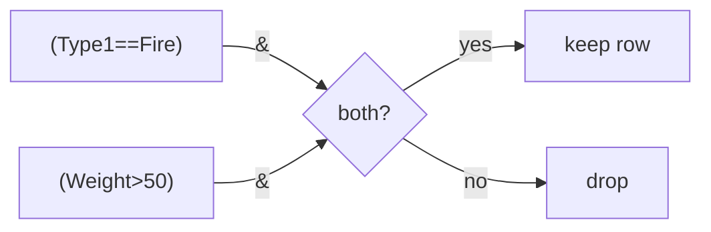

# 2.2 Filtering — Find Rows

[[2.1 Selection|← Prev]] | [[3.1 Aggregation|Next → 3.1 Aggregation]]

## ⚡ Quick Peek — copy what you need

| I want... | Code |
|---|---|
| Fire only | `mask = df["Type1"]=="Fire"` then `df[mask]` |
| Heavy | `df[df["Weight"] > 100]` |
| Fire AND heavy | `df[(df["Type1"]=="Fire") & (df["Weight"]>50)]` |
| Water OR Flying | `df[(df["Type1"]=="Water") \| (df["Type2"]=="Flying")]` |
| NOT Fire | `df[~(df["Type1"]=="Fire")]` |
| In list | `df[df["Name"].isin(["Bulbasaur","Mewtwo"])]` |
| Range | `df[df["Weight"].between(10, 20)]` |
| No Type2 | `df[df["Type2"].isna()]` |
| Has Type2 | `df[df["Type2"].notna()]` |
| Name has "saur" | `df[df["Name"].str.contains("saur")]` |
| Starts / ends | `df[df["Name"].str.startswith("P")]` / `.str.endswith("eon")` |
| Readable | `df.query("Type1=='Fire' and Weight>50")` |
| Top 3 heavy | `df.nlargest(3, "Weight")` |

Setup:

```python
import pandas as pd
df = pd.read_csv("/home/ravox/machine_learning/code/pokemon.csv")
df.columns = df.columns.str.replace("␍", "", regex=False).str.strip()
```

## Core idea — 2 steps, always

**Step 1** make True/False list. **Step 2** put it in `df[...]`.

```python
mask = df["Type1"] == "Fire"  # True where Fire, False elsewhere
fire = df[mask]               # keep True rows only
print(fire[["Name","Type1"]].head(3).to_string())  # 12 rows total
```

One-line version (same thing):

```python
print(df[df["Weight"] > 100][["Name","Weight"]].head(3).to_string())
# Venusaur=100 excluded, >100 is strict
```

## `&` `|` `~` — deep, simple, complete

Plain rules:

- `&` = AND — both must be True
- `|` = OR — at least one True
- `~` = NOT — flips True↔False
- Use `&` not `and`, `|` not `or`. Always wrap each side in `()`.

Truth table (memorize this):

| A | B | A `&` B | A `\|` B | `~`A |
|---|---|---|---|---|
| True | True | True | True | False |
| True | False | False | True | False |
| False | True | False | True | True |
| False | False | False | False | True |



Examples — one per operator:

AND — Fire that is also heavy:

```python
is_fire = df["Type1"] == "Fire"
is_heavy = df["Weight"] > 50
print(df[is_fire & is_heavy][["Name","Weight"]].to_string())
```

OR — Water type, or Flying second type:

```python
print(df[(df["Type1"]=="Water") | (df["Type2"]=="Flying")].shape)
```

NOT — everything except Fire (138 = 150-12):

```python
print(df[~(df["Type1"]=="Fire")].shape)
```

Starter example — Grass AND Poison (9 rows: Bulbasaur line + Oddish line + Bellsprout line):

```python
mask = (df["Type1"]=="Grass") & (df["Type2"]=="Poison")
print(df[mask][["Name"]].to_string())  # 9 rows
```

> [!warning] 2 gotchas
> 1. No `()` → error or wrong answer. Always `(a) & (b)`.
> 2. `NaN == x` is False. Type2 NaNs never match `==`, use `.isna()`.

## `isin` / `between` / `isna` — shortcuts

**isin** = in this list? Cleaner than 3× `|`.

```python
starters = ["Bulbasaur", "Charmander", "Squirtle"]
print(df[df["Name"].isin(starters)].to_string())
```

```python
print(df[df["Type1"].isin(["Fire","Water"])].shape)  # 40
```

**between** = in range, both ends included.

```python
print(df[df["Weight"].between(10, 20)][["Name","Weight"]].head(3).to_string())
# same as (Weight>=10) & (Weight<=20), shorter
```

**isna** = is empty? Only way to find NaN.

```python
print(df[df["Type2"].isna()].shape)   # (83,7) mono-type, 55%
print(df[df["Type2"].notna()].shape)  # (67,7) dual-type
```

## Text search

```python
print(df[df["Name"].str.contains("saur")]["Name"].tolist())
# ['Bulbasaur','Ivysaur','Venusaur']
```

```python
print(df[df["Name"].str.startswith("P")]["Name"].head(3).tolist())
print(df[df["Name"].str.endswith("eon")]["Name"].tolist())  # Jolteon, Flareon...
```

Case-insensitive (lower first):

```python
print(df[df["Name"].str.lower().str.contains("mew")]["Name"].tolist())
```

Regex start `^Char`:

```python
print(df[df["Name"].str.contains("^Char")]["Name"].tolist())
```

## `query` + `nlargest` — readable + fast

Same filter as sentence:

```python
print(df.query("Type1 == 'Fire' and Weight > 50")[["Name","Weight"]].to_string())
```

Use variable with `@`:

```python
min_w = 100
print(df.query("Weight > @min_w")[["Name","Weight"]].head(3).to_string())
```

Top-N without full sort:

```python
print(df.nlargest(3, "Weight")[["Name","Weight"]].to_string())  # Snorlax 460 top
print(df.nsmallest(3, "Weight")[["Name","Weight"]].to_string())
```

## Reference

| Sign | Name | Meaning | Example |
|---|---|---|---|
| `== > < !=` | compare | yes/no per row | `df["Weight"]>100` |
| `&` | AND | both True | `(a)&(b)` |
| `\|` | OR | either True | `(a)\|(b)` |
| `~` | NOT | flip | `~(a)` |
| `.isin` | in list | membership | `s.isin([...])` |
| `.between` | range | inclusive | `s.between(10,20)` |
| `.isna/.notna` | empty? | NaN test | `s.isna()` |
| `.str.contains/startswith/endswith` | text | search | `s.str.contains("saur")` |
| `.query` | sentence | readable | `df.query("...")` |
| `.nlargest/.nsmallest` | top-N | extremes | `df.nlargest(3,"Weight")` |

[[3.1 Aggregation|Next → 3.1 Aggregation]]
