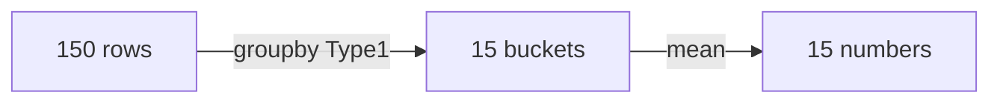

# 3.1 Aggregation — Summarize

[[2.2 Filtering|← Prev]] | [[3.2 Data Cleaning|Next → 3.2 Data Cleaning]]

## ⚡ Quick Peek

| I want... | Code |
|---|---|
| Average weight | `df["Weight"].mean()` |
| Max / min / median | `df["Weight"].max()` / `.min()` / `.median()` |
| How many of each type | `df["Type1"].value_counts()` |
| Avg per type | `df.groupby("Type1")["Weight"].mean()` |
| Count+mean+max per type | `df.groupby("Type1")["Weight"].agg(["count","mean","max"])` |
| Nice names | `df.groupby("Type1").agg(n=("Name","count"), avg=("Weight","mean"))` |
| Compare row to group avg | `df.groupby("Type1")["Weight"].transform("mean")` |
| Keep big groups only | `df.groupby("Type1").filter(lambda g: len(g)>=20)` |
| 2D table | `pd.pivot_table(df, values="Weight", index="Type1", aggfunc="mean")` |

Setup:

```python
import pandas as pd
df = pd.read_csv("/home/ravox/machine_learning/code/pokemon.csv")
df.columns = df.columns.str.replace("␍", "", regex=False).str.strip()
```

## One number

Collapses 150 → 1.

```python
print(df["Weight"].mean())    # 46.23
print(df["Weight"].median())  # 30.0 (middle, ignores Snorlax skew)
print(df["Weight"].max())     # 460.0 Snorlax
print(df["Weight"].min())     # 0.1
```

Count skips NaN:

```python
print(df["Weight"].count())  # 150
print(df["Type2"].count())   # 67 (83 missing!)
```

## Fastest group: `value_counts`

No groupby needed for "how many of each?"

```python
print(df["Type1"].value_counts().head(5).to_string())
# Water 28, Normal 22, Poison 14, Fire 12, Grass 12
```

```python
print(df["Type1"].value_counts(normalize=True).round(2).head(3).to_string())
# fractions
```

## `groupby` — split → compute → combine



Avg weight per type, heaviest first:

```python
avg = df.groupby("Type1")["Weight"].mean()
print(avg.sort_values(ascending=False).round(1).to_string())
# Rock top (Onix/Golem heavy)
```

Size per group:

```python
print(df.groupby("Type1").size().sort_values(ascending=False).head(5).to_string())
```

Many stats at once:

```python
print(df.groupby("Type1")["Weight"].agg(["count","mean","max"]).round(1).head(5).to_string())
```

Nice column names:

```python
out = df.groupby("Type1").agg(n=("Name","count"), avg_w=("Weight","mean"), max_h=("Height","max"))
print(out.sort_values("avg_w", ascending=False).round(1).to_string())
# n=("Name","count") = new col n counts names
```

## `transform` vs `filter` — 1-line difference

**transform** = same length back (150). Compare each row to its group:

```python
df["AvgOfType"] = df.groupby("Type1")["Weight"].transform("mean")
print(df[["Name","Type1","Weight","AvgOfType"]].head(3).to_string())
# Bulbasaur 6.9 vs Grass avg
```

**filter** = keep whole groups:

```python
big = df.groupby("Type1").filter(lambda g: len(g) >= 20)
print(big["Type1"].unique())  # Water, Normal
# lambda g: ... = test each bucket. Keep bucket if 20+ rows.
```

Pivot (Excel-style 2D):

```python
print(pd.pivot_table(df, values="Weight", index="Type1", aggfunc="mean").round(1).head(5).to_string())
```

## Reference

| Method | Returns | Example |
|---|---|---|
| `.mean/.median/.min/.max/.sum` | 1 number | `s.mean()` |
| `.count/.nunique` | count non-missing | `s.count()` |
| `.value_counts` | table | `df["Type1"].value_counts()` |
| `.groupby(k)[c].mean()` | 1 per group | per-type avg |
| `.agg([...])` | many per group | `.agg(["mean","max"])` |
| named agg | named cols | `.agg(n=("Name","count"))` |
| `.transform` | same length | broadcast avg |
| `.filter` | subset groups | big groups |
| `pivot_table` | 2D | matrix |
