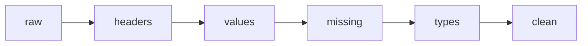

# 3.2 Data Cleaning — Fix Mess

[[3.1 Aggregation|← Prev]] | [[4.0 Cheat Sheet|Next → 4.0 Cheat Sheet]]

## ⚡ Quick Peek — the 5 fixes

| Mess | Code |
|---|---|
| See dirt | `df.columns.tolist()` , `df.isna().sum()` , `df["Legendary"].unique()` |
| Fix headers (no loop!) | `df.columns = df.columns.str.replace("␍","",regex=False).str.strip()` |
| Fix values `0␍`→`0` | `df["Legendary"] = df["Legendary"].str.replace("␍","",regex=False).str.strip()` |
| Text → number | `df["Legendary"] = df["Legendary"].astype(int)` |
| Keep NaN / fill / drop Type2 | `df["Type2"].isna().sum()` / `df["Type2"].fillna("None")` / `df.dropna(subset=["Type2"])` |
| Safe number | `pd.to_numeric(df["Weight"], errors="coerce")` |
| Category | `df["Type1"].astype("category")` |
| Dupes | `df.duplicated().sum()` / `df.drop_duplicates()` |
| Save | `df.to_csv("clean.csv", index=False)` |

Dirt in this file: header `Legendary␍`, values `0␍`/`1␍`, 83 missing Type2.



Setup:

```python
import pandas as pd
df = pd.read_csv("/home/ravox/machine_learning/code/pokemon.csv")
```

## 1. Diagnose (30 sec)

```python
print(df.columns.tolist())  # [..., 'Legendary␍'] = dirty
print(df.isna().sum().to_string())  # Type2 83
print(df["Legendary␍"].unique())  # ['0␍' '1␍' '1']
```

No fix until you see the problem.

## 2. Headers — no loop version

Why old tutorials show a loop: `for c in columns...`. You don't need it. `.str` does all names at once.

```python
df.columns = df.columns.str.replace("␍", "", regex=False).str.strip()
print(df.columns.tolist())  # [..., 'Legendary'] clean
```

One line. Reads as: "in all column names, delete ␍, trim spaces."

## 3. Legendary — clean text, then number

Step A — text clean:

```python
df["Legendary"] = df["Legendary"].astype(str).str.replace("␍", "", regex=False).str.strip()
print(df["Legendary"].unique())  # ['0' '1']
```

Step B — to int:

```python
df["Legendary"] = df["Legendary"].astype(int)
print(df[df["Legendary"]==1][["Name"]].to_string())  # check: birds + Mewtwo?
```

## 4. Type2 — pick one strategy

83 missing = real (mono-type). Choose by question:

Keep (best default) — do nothing:

```python
print(df["Type2"].isna().sum())  # 83
```

Fill for pretty tables:

```python
filled = df["Type2"].fillna("None")  # original untouched
```

Drop for dual-only study (67 left):

```python
dual = df.dropna(subset=["Type2"])
print(dual.shape)  # (67, 7)
```

> [!warning] `df.dropna()` with no subset drops all 83 rows (55%!). Always add `subset=["Type2"]`.

## 5. Types + dupes + save

```python
print(df.dtypes.to_string())
df["Type1"] = df["Type1"].astype("category")  # 15 values → faster groupby
df["Weight"] = pd.to_numeric(df["Weight"], errors="coerce")  # garbage→NaN, no crash
```

```python
print(df.duplicated().sum())  # 0 good
print(df["Name"].duplicated().sum())  # 0
```

Full copy-paste when ready:

```python
def load_clean(path="/home/ravox/machine_learning/code/pokemon.csv"):
    import pandas as pd
    df = pd.read_csv(path)
    df.columns = df.columns.str.replace("␍", "", regex=False).str.strip()
    df["Legendary"] = df["Legendary"].astype(str).str.replace("␍", "", regex=False).str.strip().astype(int)
    df["Height"] = pd.to_numeric(df["Height"], errors="coerce")
    df["Weight"] = pd.to_numeric(df["Weight"], errors="coerce")
    return df.drop_duplicates().reset_index(drop=True)

df = load_clean()
df.to_csv("clean_pokemon.csv", index=False)
```

## Reference

| Method | What | Example |
|---|---|---|
| `.isna().sum()` | find missing | `df.isna().sum()` |
| `.str.replace/.str.strip` | clean text | `s.str.replace("␍","")` |
| `.astype` | convert | `s.astype(int)` |
| `to_numeric(coerce)` | safe number | `pd.to_numeric(s, errors="coerce")` |
| `astype("category")` | fixed set | 15 types |
| `.fillna` | fill | `s.fillna("None")` |
| `.dropna(subset=)` | drop | `df.dropna(subset=["Type2"])` |
| `.drop_duplicates` | dedup | `df.drop_duplicates()` |
