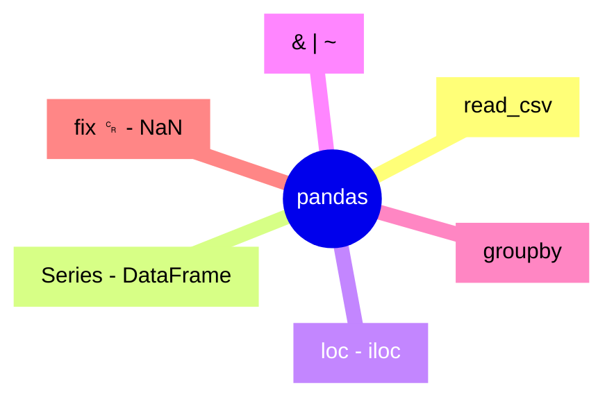

# 4.0 Cheat Sheet — Peek Here First

[[3.2 Data Cleaning|← Prev]]

> [!tip] This is your fast reference. No story. Find task → copy code.

Setup for all:

```python
import pandas as pd
df = pd.read_csv("/home/ravox/machine_learning/code/pokemon.csv")
df.columns = df.columns.str.replace("␍", "", regex=False).str.strip()
```

## Task → code

| Task | Code |
|---|---|
| Open | `pd.read_csv(path)` |
| Name index | `pd.read_csv(path, index_col="Name")` |
| Peek | `df.head(3)` / `df.tail(3)` / `df.sample(3)` |
| Size/health | `df.shape` / `df.info()` / `df.isna().sum()` |
| 1 col / N cols | `df["Name"]` / `df[["Name","Weight"]]` |
| By name / number | `df.loc["Pikachu","Weight"]` / `df.iloc[0,1]` |
| Filter | `df[df["Type1"]=="Fire"]` |
| AND / OR / NOT | `(a)&(b)` / `(a)\|(b)` / `~(a)` |
| In list / range | `df[s.isin([...])]` / `df[s.between(10,20)]` |
| Missing | `df[s.isna()]` / `s.fillna("None")` / `df.dropna(subset=["Type2"])` |
| Text | `df[s.str.contains("saur")]` / `s.str.startswith("P")` |
| Sentence | `df.query("Weight>100")` |
| Top 3 | `df.nlargest(3,"Weight")` |
| Sort | `df.sort_values("Weight", ascending=False)` |
| Freq | `df["Type1"].value_counts()` |
| Avg per type | `df.groupby("Type1")["Weight"].mean()` |
| Multi-stat | `df.groupby("Type1").agg(n=("Name","count"), avg=("Weight","mean"))` |
| Save | `df.to_csv("clean.csv", index=False)` |

## All methods — what / how

| Method | What | How |
|---|---|---|
| `read_csv` | open | `pd.read_csv(path, usecols, nrows)` |
| `Series` / `DataFrame` | 1D / 2D | `df["Name"]` |
| `shape/dtypes/info/describe` | inspect | `df.info()` |
| `unique/nunique/value_counts` | categories | `df["Type1"].value_counts()` |
| `sort_values` | order | `df.sort_values("Weight")` |
| `loc/iloc/at/iat` | select | `df.loc["Pikachu"]` / `df.iloc[0]` |
| `& \| ~` | combine | `(a)&(b)` = both, `(a)\|(b)` = either, `~(a)` = flip |
| `isin/between/isna` | shortcuts | `s.isin()`, `s.between()`, `s.isna()` |
| `str.*` | text | `s.str.contains()` |
| `map/apply/replace` | change | `s.map({...})` |
| `groupby/agg/transform/filter` | summarize | `df.groupby("Type1")["Weight"].mean()` |
| `pivot_table/crosstab` | 2D | `pd.crosstab(a,b)` |
| `astype/to_numeric` | convert | `s.astype(int)` |
| `rename/drop/set_index` | reshape | `df.rename(columns={...})` |
| `to_csv` | save | `df.to_csv("o.csv", index=False)` |



> [!example] Drill — 1 line each
> Fire count → `df[df["Type1"]=="Fire"].shape[0]` → 12
> Heaviest Water → `df[df["Type1"]=="Water"].nlargest(1,"Weight")`
> Mono % → `df["Type2"].isna().mean()` → 0.55
